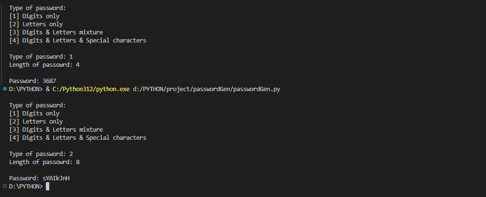
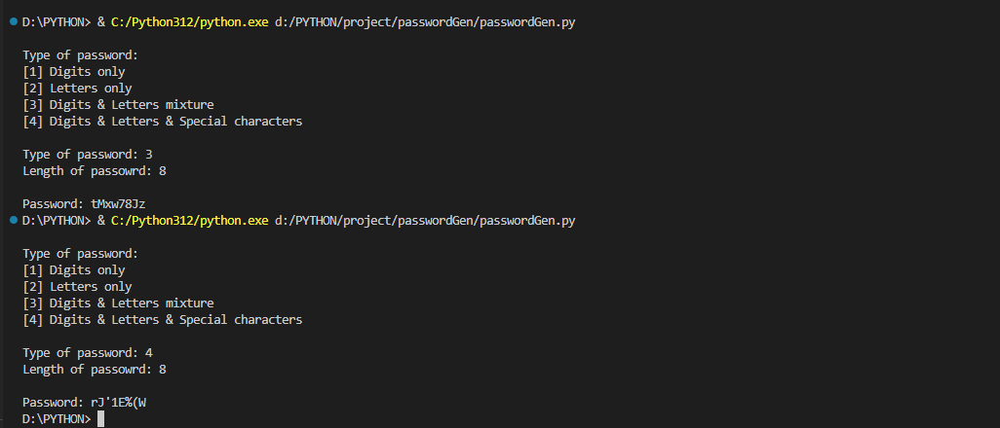

# SIMPLE PASSWORD GENERATOR WITH PYTHON
- You can specify the length of the password
- You can also specify the type of password i.e digits only, letters only, letters and digits mixture or letters, digits and special characters mixture
## screenshots

